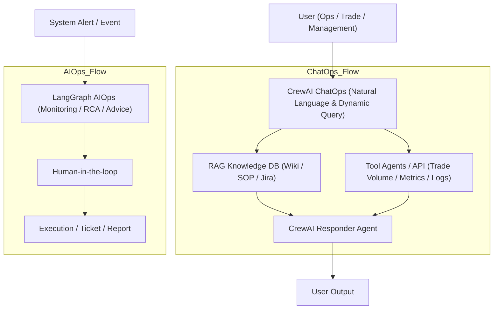

# Enterprise ChatOps & AIOps Platform

An enterprise-grade demonstration system combining **ChatOps** (Natural Language Operations) and **AIOps** (Automated Incident Management) capabilities. This project showcases how to use AI agents to streamline IT operations, knowledge retrieval, and incident response.

## 🚀 Key Features

### 1. ChatOps (Powered by CrewAI)
- **Intelligent Assistant**: Interact with your system using natural language.
- **RAG Knowledge Base**: Automatically retrieves answers from internal documentation (Wiki, SOPs, Playbooks).
- **Real-time Insights**: Fetches live system metrics (Trade Volume, System Status) via tool-equipped agents.
- **Context Awareness**: Maintains conversation history for interactive troubleshooting.

### 2. AIOps (Powered by LangGraph)
- **Automated Alert Handling**: Simulates workflows for high-severity alerts (e.g., CPU Spikes, Latency).
- **Root Cause Analysis (RCA)**: Executes a directed workflow to analyze metrics, logs, and changes.
- **Human-in-the-Loop**: Requires operator approval before executing remediation actions.

## 🏗️ System Architecture



## 🛠️ Tech Stack

- **Agent Orchestration**: [CrewAI](https://crewai.com) (ChatOps), [LangGraph](https://langchain-ai.github.io/langgraph/) (AIOps)
- **Frontend**: [Streamlit](https://streamlit.io)
- **Vector Store**: FAISS (Local RAG)
- **Package Management**: `uv` (Astral)
- **LLM Support**: OpenAI GPT-4, Local Models (via Ollama)

## 📂 Project Structure

```text
aiops/
├── chatops/            # CrewAI Agents (Knowledge, Data, Responder)
├── aiops_workflow/     # LangGraph Workflows for RCA
├── knowledge_base/     # RAG System (Ingestion & Retrieval)
├── frontend/           # Streamlit User Interface
├── config/             # Configuration & Settings
└── main.py             # Entry point
```

## ⚡ Getting Started

### Prerequisites
- Python 3.10+
- [uv](https://github.com/astral-sh/uv) (Recommended for fast dependency management)

### Installation

1. **Clone the repository**
   ```bash
   git clone https://github.com/jxauyhj-copilot/aiops.git
   cd aiops
   ```

2. **Install dependencies**
   ```bash
   uv sync
   # OR using pip
   # pip install -r pyproject.toml
   ```

3. **Configure Environment**
   Create a `.env` file in the root directory:
   ```bash
   cp .env.example .env
   ```
   Add your API keys (e.g., `OPENAI_API_KEY`, `OPENAI_MODEL_NAME`).

4. **Run the Application**
   ```bash
   uv run streamlit run frontend/app.py
   ```

## 📖 Usage Guide

1. **Knowledge Management**: Go to the "Knowledge Management" tab to upload your SOPs, Architecture Diagrams, or Playbooks (TXT/PDF).
2. **ChatOps**: Use the Chat interface to ask questions like:
   - *"How do I deploy the trading engine?"* (Uses RAG)
   - *"What is the current trade volume?"* (Uses Tools)
   - *"Summarize the incident response protocol."* (Uses RAG)
3. **AIOps Simulation**: Go to the "AIOps Dashboard" to trigger simulated alerts and watch the agent workflow analyze the root cause.

---
*This project is a demonstration of AI-driven Operations.*
