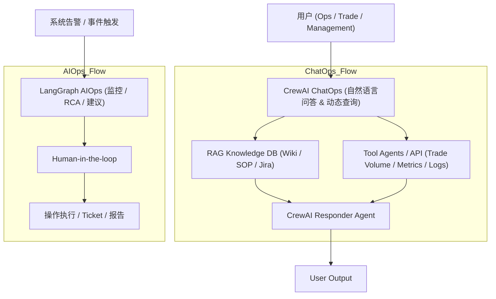

# Enterprise ChatOps & AIOps Demo

This project demonstrates an enterprise-grade system combining ChatOps and AIOps capabilities.

## Features

### 1. ChatOps (CrewAI)
- **Natural Language Interface**: Ask questions about system status or static knowledge.
- **RAG Integration**: Queries static documentation (Wiki, SOPs).
- **Dynamic Data**: Queries real-time metrics (Trade Volume, System Status).
- **Orchestration**: Uses CrewAI to manage agents (Knowledge Retriever, Data Analyst, Responder).

### 2. AIOps (LangGraph)
- **Automated Alerting**: Simulates handling of system alerts (CPU, Latency).
- **RCA Workflow**: Directed Acyclic Graph (DAG) for Root Cause Analysis.
- **Human-in-the-loop**: Approval step before executing remediation.

## Structure

- `chatops/`: CrewAI agents and tools.
- `aiops_workflow/`: LangGraph workflow for alert handling.
- `knowledge_base/`: Vector DB and ingestion scripts.
- `frontend/`: Streamlit UI for interaction.
- `config/`: Configuration settings.

## Setup

1. Install `uv` (if not already installed):
   ```bash
   curl -LsSf https://astral.sh/uv/install.sh | sh
   ```

2. Create virtual environment and install dependencies:
   ```bash
   uv venv
   source .venv/bin/activate
   uv pip install -r pyproject.toml
   # Or simply sync:
   uv sync
   ```

3. Configure environment:
   Copy `.env.example` to `.env` and add your API keys (OpenAI, etc.).

4. Run the Demo:
   ```bash
   uv run streamlit run frontend/app.py
   ```

## Project Background and Design Requirements (Original)

### 一、目标概述

你希望构建一个 企业级可落地 Demo 系统，包含两条主要功能线：

**ChatOps（知识 + 查询 + 动态数据）**

*   用户可以问系统问题（自然语言）
*   系统回答基于：
    *   静态知识（Wiki、SOP、Jira 等）
    *   动态数据（Trade Volume、Match Count、系统状态）
    *   可选 LLM 做解释 / 汇总

**AIOps（监控告警 + RCA + 建议）**

*   系统自动接收告警（CPU、Latency、Pod 重启等）
*   多 Agent DAG 进行 RCA / 分析
*   Human-in-the-loop 进行操作确认
*   输出建议或报告，不直接执行系统操作

### 二、需求与实现映射

| 功能 | 需求 | 技术实现 | 注意事项 |
| :--- | :--- | :--- | :--- |
| 静态知识问答 | Wiki / SOP / Jira 文档查询 | RAG + Vector DB (FAISS / Milvus / Chroma) | 文档需要切 chunk + embedding |
| 动态数据问答 | Trade Volume / Match Count / 系统状态 | Tool Agent + API 查询 | 直接查询，不依赖文档 |
| 混合问题 | 同时涉及静态 + 动态 | 先检索文档，再查询动态数据 → LLM 汇总 | 保证数据来源明确，引用文档 / 数据 |
| AIOps 告警 | CPU / Latency / Pod 重启 | LangGraph DAG + Agent | 多步骤 RCA，human-in-loop |
| RCA 输出 | 分析原因 + 建议 | LangGraph Agent + Responder Agent | 不直接执行系统操作 |
| ChatOps 输出 | 解释 + 推荐操作 | CrewAI Responder Agent | 可引用静态文档 + 动态数据 |

### 三、系统架构（Demo 版本）



### 四、执行步骤（小型 Demo 可行路线）

**Step 1：准备静态知识**
*   导出 Wiki / SOP / Jira 文档
*   清理文本、切成 chunk（500–1000 token / chunk）
*   生成 embedding → 存入向量数据库（FAISS / Milvus / Chroma）

**Step 2：准备动态数据接口**
*   Trade Volume / Match Count / 系统状态等 API
*   封装为 Tool Agent
*   输入参数：时间范围 / 数据类型
*   输出结果：JSON 或结构化数据
*   可选：格式化输出给 Responder Agent 使用

**Step 3：CrewAI ChatOps Agent**
*   **Knowledge Retriever Agent**: 查询向量数据库 → 返回 top-K chunk
*   **Tool Agent**: 查询动态数据 → 返回 JSON / 数字
*   **Responder Agent**: 整合文档 + 动态数据 → 生成回答 (可选调用 LLM)

**Step 4：LangGraph AIOps**
*   定义告警触发 DAG（节点例子）：Metric Agent → Log Agent → Change Agent → RCA Agent
*   每个节点只处理对应任务：
    *   Metric Agent：CPU / Latency / Memory
    *   Log Agent：异常日志
    *   Change Agent：Deployment / Config
    *   RCA Agent：整合证据，生成 RCA + 建议
*   Human-in-the-loop：对建议进行审批，决定是否执行操作 / 创建 ticket

**Step 5：集成 Demo**
*   用户发问 → CrewAI ChatOps
*   静态问题 → RAG 返回
*   动态问题 → Tool Agent 调用 API
*   混合问题 → Responder Agent 整合
*   系统告警 → LangGraph AIOps DAG
*   RCA 输出可选提供给 CrewAI 做解释 / 汇报

**Step 6：Demo 优化点**
*   Intent classifier：区分静态 / 动态 / 混合问题
*   Top-K chunk 检索 + 文档引用
*   可选缓存机制：动态数据避免重复查询
*   日志记录：ChatOps / AIOps 输出可追溯

### 五、小型 Demo 技术栈建议

| 模块 | 技术 / 工具 |
| :--- | :--- |
| ChatOps Agent Orchestration | CrewAI |
| 文档向量检索 | FAISS / Milvus / Chroma |
| Embedding | OpenAI text-embedding-3-large / 本地 LLaMA2 |
| 动态数据查询 | Tool Agent 调用 Trade DB / API / Metrics API |
| 告警处理 | LangGraph DAG + Agent |
| LLM 回答生成 | OpenAI GPT-4 / Claude / LLaMA2 |
| Python Demo | FastAPI / Streamlit 可做前端界面 |

### 🔹 Demo 关键成果

*   用户可以问系统问题
*   系统能回答：
    *   静态文档问题（直接返回或引用）
    *   动态数据问题（实时查询）
    *   复杂问题（结合静态 + 动态 + LLM汇总）
*   系统告警触发时：
    *   自动 RCA
    *   输出建议给 human-in-the-loop
*   完全可扩展到企业级 ChatOps + AIOps
